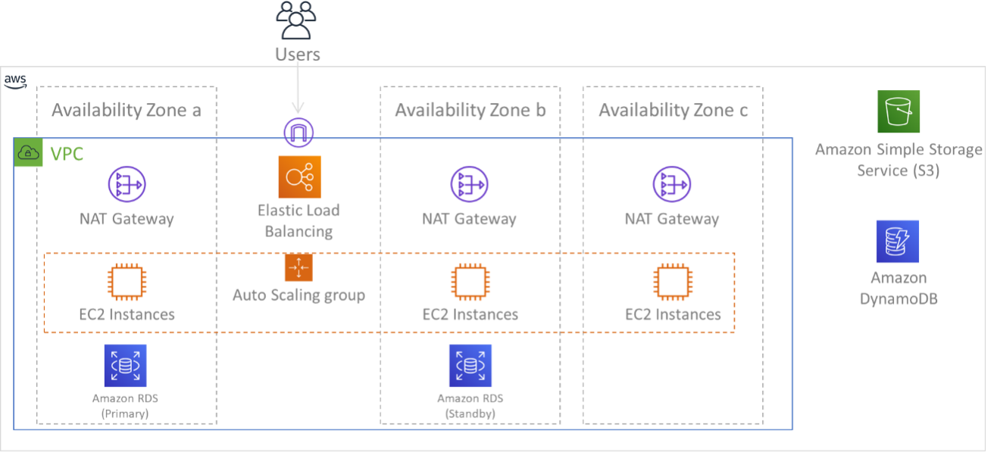

# Multi-AZ Deployment for Amazon EC2 Instances

## Overview

This project focuses on achieving enhanced redundancy and reliability by deploying Amazon EC2 instances into multiple Availability Zones (AZs). The multi-AZ deployment strategy ensures that the application remains highly available even in the face of potential failures or disruptions in a specific Availability Zone.

## Features

- **Fault Tolerance:** The project employs a multi-AZ deployment model, distributing EC2 instances across different Availability Zones. This helps mitigate the impact of failures in a single zone, providing fault tolerance and improving the overall resilience of the system.

- **High Availability:** With instances running in multiple AZs, the application can maintain continuous operation even if one Availability Zone experiences issues. This design enhances the availability of the application and minimizes downtime.

## Getting Started

Follow these steps to deploy the EC2 instance to multi-AZ :

1. **Launch EC2 Instances:**
   - Manually launch Amazon EC2 instances in different Availability Zones within your desired region using the AWS Management Console.

2. **Configure Instances:**
   - Configure the instances with the necessary settings, such as instance type, key pairs, security groups, and user data scripts.

3. **Load Balancer Setup:**
   - Set up an Elastic Load Balancer (ELB) or Application Load Balancer (ALB) to distribute traffic across the EC2 instances. Configure the load balancer to operate across multiple Availability Zones.

4. **Database Configuration (Optional):**
   - If your application uses a database, consider deploying a multi-AZ database setup (e.g., Amazon RDS Multi-AZ deployment) to enhance data availability and durability.

## Architecture

The architecture of this project involves strategically deploying Amazon EC2 instances across multiple Availability Zones within a specified region, utilizing a load balancer for distributing incoming traffic. This diagram illustrates the high-level architecture:

()

## Contributing

Contributions are welcome! If you find any issues or have suggestions for improvements, please open an issue or submit a pull request. 

## Acknowledgments

Special thanks to the AWS community and contributors who have helped improve and enhance this multi-AZ deployment project.

